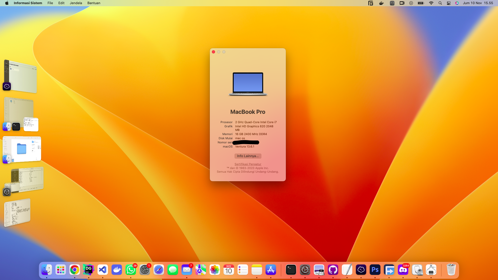

# Lenovo ThinkPad X280 - OpenCore EFI

   <strong>Ventura: Success Perfect</strong>
    
   <strong>upgrade to Sonoma still no problem</strong>

 

## 💻 Tested devices

My Hardware:

| Category     | Component                                                  |
| ---------    | -----------------------------------------------------------|
| CPU          | Intel(R) Core(R) i5-8350U @ 1.7GHz (turbo boost 3.6GHz)    |
| GPU          | Intel UHD Graphics 620                                     |
| SSD          | Samsung SSD 860 EVO 250G Media (Install on SSD External)   |
| Memory       | 16GB DDR4 2400Mhz                                          |
| Camera       | 720p Camera                                                |
| WiFi & BT    | Intel(R) Dual Band Wireless-AC 8265 (802.11a/b/g/n/ac)     |
| PORT         | 1 Thunderbolt 2 USB-C Ports                                |
| UEFI Version | N20ET62W 1.47                                              |
| Display      | 1920x1080 60Hz IPS Laptop display (1080p)                  |

## Introduction

Thank's to [@valnoxy](https://github.com/valnoxy)

Watch this video for some change config [Link Video](https://youtube.com/clip/UgkxxrzwlMQl-F-rxeDcYc57MDgtKin9aoi6?feature=shared)

### EFI folders

This repo includes multiple EFI configuations for different macOS Versions.

| EFI               | Description                                                               | Type      |
| ----------------- | ------------------------------------------------------------------------- | --------- |
| `EFI`             | Supports macOS Ventura & Sonoma             | `Stable`  |

## Status

  

<strong>✅ What's working</strong>

 

- [X] Intel WiFi & Bluetooth (thanks to [itlwn](https://github.com/OpenIntelWireless/itlwm))
- [X] Brightness / Volume Control
- [X] Battery Information
- [X] Audio (Audio Jack & Speaker)
- [X] USB Ports & Built-in Camera
- [X] Graphics Acceleration
- [X] Trackpoint / Touchpad
- [X] Power management / Sleep
- [X] FaceTime / iMessage (iServices)
- [X] HDMI
- [X] Automatic OS updates
- [X] Handoff / Universal Clipboard
- [X] Sidecar (Cable) / AirPlay to Mac
- [X] SIP / FireVault 2
- [X] USB-C
- [X] Safari DRM
- [x] Dualbooting Windows (with OpenCore)

  

<strong>⚠️ What's not working</strong>

 

- [ ] AirDrop & Continuity (only devices with Intel WiFi)
- [ ] Fingerprint Reader (Disabled with NoTouchID kext)
- [ ] Sidecar Wireless
- [ ] Apple Watch Unlock

  

<strong>🔄 Not tested</strong>

 

- [ ] WWAN

